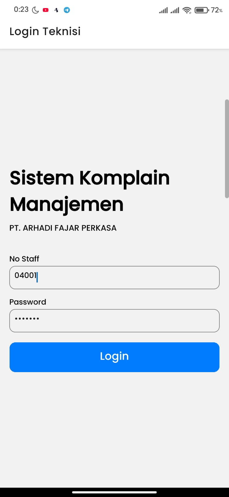

# 📱 Aplikasi Mobile Teknisi - Sistem Komplain Manajemen

Aplikasi mobile ini merupakan bagian dari sistem manajemen komplain pelanggan. Dibuat menggunakan **React Native + Expo**, aplikasi ini ditujukan khusus untuk **teknisi** dalam menangani dan melaporkan penanganan keluhan pelanggan.

> 🔒 Hanya role teknisi yang dapat login ke aplikasi ini.

---

## 📦 Teknologi

- React Native
- Expo
- Axios (untuk komunikasi dengan API Laravel)
- AsyncStorage (untuk menyimpan token login)
- React Navigation

---

## 👤 Role & Akses

| Role    | Akses Aplikasi Mobile | Akses Aplikasi Web |
| ------- | --------------------- | ------------------ |
| Teknisi | ✅ Ya                 | ✅ Ya              |
| Lainnya | ❌ Tidak              | ✅ Ya              |

---

## 🚀 Fitur Aplikasi Mobile (Teknisi)

- Login menggunakan akun teknisi
- Melihat daftar keluhan dari pelanggan
- Melihat detail keluhan
- Mengisi hasil penanganan keluhan
- Logout

---

## ⚙️ Cara Instalasi & Menjalankan Aplikasi

Berikut langkah-langkah untuk menjalankan proyek React Native (Expo):

### 1. Clone Repository

```bash
git clone https://github.com/Mhmmadlthfi/teknisi-mobile-app.git && cd teknisi-mobile-app
```

### 2. Install Dependencies

```bash
npm install
```

> Pastikan Anda sudah menginstal [Node.js](https://nodejs.org/) dan [Expo CLI](https://docs.expo.dev/get-started/installation/), jika belum, Anda bisa menginstalnya dengan:
>
> ```bash
> npm install -g expo-cli
> ```

### 3. Jalankan Proyek

```bash
npx expo start
```

Aplikasi akan terbuka di browser dengan QR code.

### 4. Jalankan di Perangkat Android

- Buka aplikasi **Expo Go** di Android Anda.
- Scan QR code yang muncul di terminal atau browser.

> ⚠️ Aplikasi ini saat ini **belum dibuild ke APK**, dan hanya bisa dijalankan secara lokal menggunakan Expo Go.

---

## 📸 Cuplikan Layar

**Login Screen**

<p align="center">
    
</p>

**Home Screen**

<p align="center">
    
</p>

**List Keluhan**

<p align="center">
    
</p>

**Halaman Penanganan**

<p align="center">
    
    
</p>

**Halaman Input Hasil Penanganan**

<p align="center">
    
    
</p>

---

## ℹ️ Informasi Tambahan

- Token disimpan secara lokal menggunakan AsyncStorage.
- Jika logout, token akan dihapus dan pengguna kembali ke halaman login.
- Tidak tersedia halaman registrasi atau reset password dari aplikasi.

---

## 🔗 Tautan Terkait

- 🔗 Backend Laravel (Web App):

  - **Petugas** : [https://helloluthfiii.my.id/aftersales/admin](https://helloluthfiii.my.id/aftersales/admin)
  - **Pelanggan** [https://helloluthfiii.my.id/aftersales/guest](https://helloluthfiii.my.id/aftersales/guest)

- 🔗 Repository Web (Laravel): [https://github.com/Mhmmadlthfi/sistem-komplain-manajemen](https://github.com/Mhmmadlthfi/sistem-komplain-manajemen)

---

## 📝 Lisensi

Proyek ini dibuat sebagai bagian dari tugas akhir untuk memenuhi syarat kelulusan pada konsentrasi **Smart System Application**. Penggunaan dan pengembangan lebih lanjut disesuaikan dengan kebutuhan.
